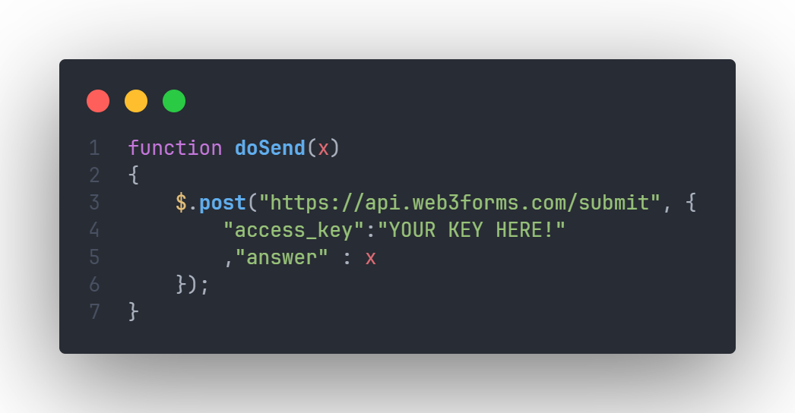
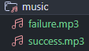

# FE Valentine

A front-end valentine that will send you the result.

## How it works
The site will send the result to Web3Forms & they will send it back to you through the email you registered for the access key.

## Usage
1. Go to [Web3Forms](https://web3forms.com/) and get a access key.

2. Replace it in the **script.js** file.

3. (Optional) You can add music into **music** folder and named them like this:

---

